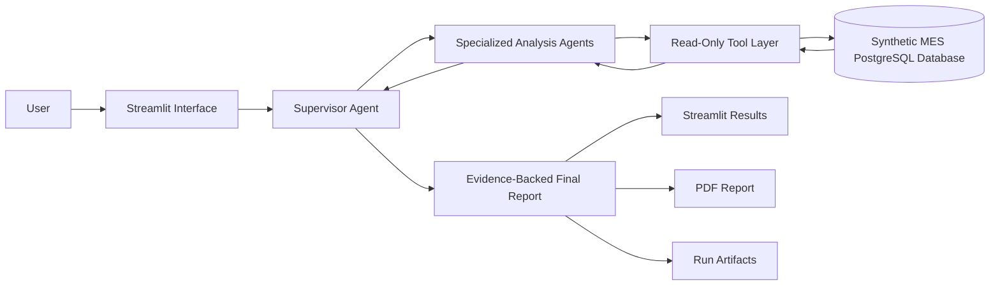

# CV → MES Agentic Defect Detection

A YOLOv8 camera watching a steel production line, wired into a synthetic
Manufacturing Execution System, where a supervisor-orchestrated team of Claude
agents investigates each defect burst and writes an evidence-backed root-cause
report.

The camera only ever sees pixels. Everything else in the report — which machine,
which work order, which product, which operator, which shift — the agents find
for themselves by querying the MES.

```
camera image
   ↓  POST /predict            YOLOv8n, 6 NEU-DET defect classes      ~50 ms
inference API (8080)
   ↓  POST /detection          every detection stored
bridge (8081)                  confidence gate ≥ 0.80, 30-second batch window
   ↓  analyze_batch()          returns an AlertID in under a second
   ↓  POST /investigate
agent backend (8000)           Supervisor → Monitor → Analyzer, over PostgreSQL
   ↓
AgentAlerts row               pending → analyzing → done, report attached
   ↓
trace dashboard (8502)         live view of every agent, tool call and query
```

## Quickstart

```bash
python Launch.py     # starts all five services; refuses to start if a port is taken
```

Opens the chat at `localhost:3000`; the trace dashboard is at `localhost:8502`.
Then fire a camera burst from a second terminal:

```bash
cd industrial-data-store-simulation-chatbot
../sample-MES-ClosedLoop-Strands-Agent/.venv/Scripts/python.exe -m bridge.simulator \
    --image-dir ../steel-defect-detection-mlops/data/demo_burst --interval 0.5
```

Within about a minute a new alert appears on the dashboard and moves from
`analyzing` to `done` with a full report.

Prerequisites: PostgreSQL with `mescopy_v1`, the three per-project virtualenvs,
and a `.env` at the repo root — copy `.env.example`, fill in `ANTHROPIC_API_KEY`
and the frontend's auth values, and on Linux or macOS run `chmod 600 .env`.
`Launch.py` reads that file and passes each service only the names it is
allowed to see. It is also the only way the Next.js app can be configured on
Windows, where its startup script refuses to read an `.env` inside `frontend/`
because it cannot verify the file's permissions there.

## Measured performance

Real numbers from this machine — Claude Haiku 4.5, CPU-only inference,
PostgreSQL on localhost. Not estimates.

| Stage | Time |
|---|---|
| YOLO inference, warm | **~50 ms** per image (first request 1.3 s, model warm-up) |
| Detection → stored in PostgreSQL | under 1 s |
| `analyze_batch()` → returns AlertID | **under 1 s** (contract requires it; the agent runs in a background thread) |
| Batch window | 30 s, fixed |
| **Burst investigation** (Monitor + Analyzer) | **37 s** |
| **Camera image → finished report** | **73 s** end to end |
| Full five-agent analysis from the dashboard | 144–260 s |
| Chat greeting (no MES query) | instant, no agent run spent |

One measured burst: 5 images → 24 detections stored → 6 cleared the 0.80 gate →
one batch → a 4,733-character report naming machine Fra-10, work order 4901, the
eBike T101 frame, the operator and the night shift.

On accuracy rather than speed, see [docs/evaluation.md](docs/evaluation.md),
which scores the agent's reports against faults deliberately injected into the
data. It is still in progress — 1 of 3 runs — and already documents a case where
the agent was confidently wrong, and a confound that invalidated one of the
three metrics.

## What is in this repository

| Directory | What it is |
|---|---|
| `steel-defect-detection-mlops/` | YOLOv8 training and the inference API. The camera. |
| `industrial-data-store-simulation-chatbot/` | Synthetic MES data generator, plus `bridge/` — the gate, the batching, the simulator and the seam. |
| `sample-MES-ClosedLoop-Strands-Agent/` | The agent backend, the tools, and the trace dashboard. |
| `frontend/` | Next.js chat UI. |
| `CONTRACTS.md` | The binding interface between the three: ports, payload, table shapes, and the `analyze_batch` seam. |

## Tests

```bash
cd sample-MES-ClosedLoop-Strands-Agent && .venv/Scripts/python.exe -m pytest tests/ -q
```

133 tests, about 4 seconds, **no API cost** — the model is faked at the retry
boundary. They cover the guardrails that bound spend (the retry budget, the
hourly run budget, one supervisor delegation per chat question, chat-history
trimming that never orphans a `toolResult`) and the security surface: internal
token auth, burst payload validation, and report paths a model cannot escape.
`RUN_FULL=1` additionally runs three real chat turns (~10 minutes, real credit).

```bash
cd industrial-data-store-simulation-chatbot && uv run pytest tests/ -q
cd steel-defect-detection-mlops && .venv/Scripts/python.exe -m pytest tests/ -q
cd frontend && npm run test:security
```

129, 16 and 45 more, all green on both Windows and Linux.

```bash
cd industrial-data-store-simulation-chatbot && python -m pytest tests/test_bridge_payload.py -q
```

Guards the payload shape between camera and bridge — a mismatch there once made
the entire pipeline a silent no-op while every service reported healthy.

---

# The agent layer in detail

A supervisor-orchestrated, multi-agent application for investigating manufacturing defects using synthetic Manufacturing Execution System data.

The project demonstrates how an agentic AI system can safely query operational data, coordinate specialized analysis agents, produce evidence-backed findings, and generate an auditable final report.


## Project Overview

Manufacturing defect investigations often require information from several operational areas:

* Defect and inspection records
* Work orders
* Machines and production lines
* Downtime events
* Maintenance history
* Employees and shifts

This application allows a user to select an analysis scope through a Streamlit interface. A supervisor agent then coordinates specialized agents that query a synthetic PostgreSQL MES database (`mescopy_v1`) through controlled, read-only tools.

The final output includes:

* A consolidated defect-analysis report
* Source-backed findings
* Categorical certainty labels
* A downloadable PDF
* Complete run artifacts for debugging and auditability

## Key Results

The following improvements were observed during development on the current synthetic dataset:

| Area                | Before                                                                              | After                                                                 |
| ------------------- | ----------------------------------------------------------------------------------- | --------------------------------------------------------------------- |
| End-to-end analysis | Runs could become trapped in failure and retry cycles for approximately three hours | Successful runs complete in under ten minutes                         |
| Downtime analysis   | Event counts were inflated by approximately 20×                                     | Counts corrected with time-overlap conditions                         |
| Certainty reporting | Reports could contain unsupported numerical confidence claims                       | Findings use `HIGH`, `MEDIUM`, or `LOW` certainty with cited evidence |
| Database coverage   | Some agents lacked an approved path to required defect data                         | Dedicated read-only defect tools were added                           |
| Run capture         | Repeated capture logic across six call sites                                        | Consolidated into two verified call sites                             |
| PDF output          | Markdown syntax appeared as raw text                                                | Markdown is rendered into formatted ReportLab elements                |

Execution time and model usage vary according to the selected scope, model, API availability, and retry behavior.

## How the System Works



A typical analysis follows these steps:

1. The user selects the defect-analysis parameters.
2. The application validates the requested scope.
3. The supervisor determines which specialized agents are needed.
4. Agents retrieve information through fixed, parameterized, read-only tools.
5. Each agent returns findings and identifies the data source used.
6. The supervisor consolidates the findings into a structured report.
7. The application saves the report, prompts, outputs, tool calls, parameters, and logs.
8. The user can review the result in Streamlit or download it as a PDF.

## Core Features

### Supervisor-Orchestrated Analysis

The system uses a hub-and-spoke architecture. The supervisor acts as the central coordinator and can select, skip, or reorder specialized agents according to the requested analysis.

This was chosen instead of:

* A fixed pipeline, which would run unnecessary stages
* Peer-to-peer agent communication, which would make execution and escalation harder to trace

### Controlled Database Access

The application treats `mes.db` as read-only.

Database tools follow several rules:

* Parameterized SQL using `?` placeholders
* Validated date-range inputs
* Explicit column selection instead of `SELECT *`
* Defined ordering
* Result limits
* No database write operations
* Fresh data generated by rerunning the synthetic-data generator

The agents do not receive unrestricted SQL write access.

### Evidence-Backed Findings

Every generated finding is expected to identify the tool or data source that supports it.

Agent output rules enforce:

* Fixed report sections
* Concise output limits
* No invented benchmark comparisons
* No unsupported percentages
* Explicit evidence references
* `HIGH`, `MEDIUM`, or `LOW` certainty labels

Categorical certainty is used because numerical confidence values generated without a statistical basis can create a false impression of precision.

### Run Artifact Capture

Every analysis produces a run-artifact directory containing the available execution evidence, including:

* Selected parameters
* Application logs
* Agent prompts
* Agent outputs
* Tool calls
* Tool arguments
* Tool results
* Final supervisor output

These artifacts make it possible to investigate failures and determine how a conclusion was produced.

### Retry and Failure Handling

Agent calls include:

* Client-side timeouts
* Automatic retries
* Centralized retry handling
* Graceful degradation when an individual agent cannot complete its task

A partial, clearly marked result is preferred over leaving the entire interface blocked indefinitely.

### Single-Run Execution

The application allows only one analysis to run at a time.

Streamlit rerenders can otherwise trigger duplicate invocations. The Run-button flow therefore uses explicit running and pending state to ensure that only one entry point can start an analysis.

### PDF Report Generation

The final supervisor report can be exported as a PDF.

A custom Markdown-to-ReportLab renderer converts supported report elements into formatted PDF content instead of printing raw Markdown characters.

## Reliability Fixes

### 1. Schema Drift

Several predefined queries attempted to join using `WorkOrders.ShiftID`, but that column did not exist in the generated database.

The actual relationship was verified using database schema inspection:

```text
WorkOrders
    → Employees through EmployeeID
    → Shifts through Employees.ShiftID
```

The affected queries were updated to use the verified schema.

**Lesson:** inspect the real database schema instead of relying on assumptions made by application code.

### 2. Downtime Join Fan-Out

Downtime records were originally joined to work orders without confirming that the event occurred during the work order.

This caused matching rows to multiply and inflated event counts by approximately 20×.

The affected queries now include a time-overlap condition:

```sql
dt.StartTime BETWEEN wo.ActualStartTime AND wo.ActualEndTime
```

This ensures that downtime events are associated only with work orders active during the relevant period.

### 3. Missing Tool Coverage

The monitoring agent originally had no approved tool for retrieving data from the defects table.

When an agent lacks a legitimate path to required information, additional prompt warnings do not solve the underlying problem. A dedicated `fetch_defect_records` tool was therefore added.

**Lesson:** hallucination can be caused by missing tool coverage, not only by the underlying model.

### 4. Unsupported Confidence Statistics

Earlier prompts requested confidence values without providing a statistical method for calculating them. This encouraged unsupported percentages and contributed to long outputs and retry loops.

The output contract now requires:

* `HIGH`, `MEDIUM`, or `LOW` certainty
* A short explanation
* The supporting tool or data source

### 5. Duplicate Streamlit Runs

Streamlit rerenders could trigger multiple concurrent agent runs.

The application now uses:

* An `analysis_running` flag
* A one-shot `work_pending` flag
* A single Run-button execution path

This prevents concurrent invocation of agent objects that are not re-entrant.

### 6. Interrupted Agent Connections

Long-running model requests could hang or fail midway through an analysis.

Timeouts, centralized retries, and graceful error handling were added so that one failed call does not necessarily invalidate the entire run.

### 7. Raw Markdown in PDFs

The original PDF generator printed Markdown syntax directly.

A Markdown-to-ReportLab renderer now handles supported formatting and escapes report content before generating the PDF.

## Technology Stack

* Python
* Streamlit
* Strands Agents
* Amazon Bedrock
* PostgreSQL (migrated from SQLite so the camera and the agent share one database)
* Pandas
* Plotly
* SQLAlchemy
* ReportLab
* `python-dotenv`

## Running the Project Locally

### Prerequisites

You need:

* Python installed
* Access to the configured Amazon Bedrock model
* AWS credentials available to the application
* A generated `mes.db` file in the project root

### 1. Clone the repository

```bash
git clone <repository-url>
cd <repository-directory>
```

### 2. Create a virtual environment

```bash
python -m venv .venv
```

Activate it using the command appropriate for your environment.

#### Windows PowerShell

```powershell
.venv\Scripts\Activate.ps1
```

#### Git Bash on Windows

```bash
source .venv/Scripts/activate
```

#### macOS or Linux

```bash
source .venv/bin/activate
```

### 3. Install dependencies

```bash
python -m pip install --upgrade pip
pip install -r requirements.txt
```

### 4. Configure the application

Create a `.env` file in the project root.

At minimum, configure the model used by the application:

```env
MES_MODEL_ID=<your-supported-bedrock-model-id>
```

Additional application settings, such as timeout, token, temperature, logging, and optional email settings, are loaded through environment variables.

Do not commit API credentials, AWS secrets, or the local `.env` file.

### 5. Start Streamlit

```bash
python -m streamlit run app.py
```

The application should open at:

```text
http://localhost:8501
```

## Generating Fresh Synthetic Data

The project uses synthetic manufacturing data.

To regenerate the database, run:

```text
industrial-data-store-simulation-chatbot/
└── app_factory/
    └── data_generator/
        └── sqlite-synthetic-mes-data.py
```

Copy the generated `mes.db` file into the root of this project before starting the Streamlit application.

The database is regenerated rather than modified by the agents.

## Development Verification

The following commands can be used to verify selected refactoring assumptions:

```bash
grep -c "MES_API_TIMEOUT" strands_agent.py
grep -c "_call_agent_with_retry" strands_agent.py
```

For the current implementation, the expected counts are:

```text
MES_API_TIMEOUT:          1
_call_agent_with_retry:   9
```

`_call_agent_with_retry` rose from 6 to 9 when the chat path started routing
through it as well. The `_save_agent_output` check was dropped: that helper
belongs to the upstream sample, not to this implementation, so its documented
count of 2 had never matched.

These checks are implementation-specific and should be updated when the relevant code is intentionally refactored.

## Deployment

A review deployment is hosted through Streamlit Community Cloud:

[Open the MES Agentic AI Learning Project](https://mes-agentic-ai-learning-project.streamlit.app/)

Access may be restricted to approved viewers because each analysis can incur model API costs.

Deployment secrets should be configured through the hosting platform and must not be stored in the repository.

## Safety Boundaries

This project deliberately limits what the agent system can do.

* The dataset is synthetic.
* Database access is read-only.
* SQL inputs are parameterized and validated.
* The system does not control factory equipment.
* The system does not write to a production MES.
* Outward executor actions are simulated.
* Generated conclusions should be reviewed by a human.
* The application is not intended to make safety-critical manufacturing decisions.

## Known Limitations

* All manufacturing data is synthetic.
* No factory hardware is connected.
* No production MES writes are supported.
* The application currently runs one analysis at a time.
* Inter-agent handoffs may still contain free-form text.
* Checkpoint and resume support has not yet been implemented.
* Model output can still be incomplete or incorrect despite tool and prompt controls.
* Performance depends on model availability and API latency.
* Community Cloud access control is intended for demonstrations, not enterprise authentication.
* Current measurements come from development runs rather than a formal benchmark suite.

## Roadmap

Planned learning and reliability features include:

* A read-only MCP server over `mes.db`
* Visible SQL query and refusal demonstrations
* A human-approval gate before simulated executor actions
* Structured JSON-schema handoffs between agents
* A live agent trace panel
* Tool-call provenance click-through
* Token and estimated cost reporting
* Controlled failure and chaos-testing modes
* Mini-RAG retrieval over manufacturing SOPs
* Checkpoint and resume support
* Additional before-and-after reliability benchmarks

## Engineering Lessons

Several broader lessons emerged while building the project:

1. **Hallucination is sometimes a tool-coverage problem.**
   An agent cannot reliably use information it has no approved way to retrieve.

2. **Requesting numerical confidence can instruct a model to fabricate precision.**
   Certainty labels should match the evidence actually available.

3. **The running schema is the source of truth.**
   Inspect the database before trusting the relationships assumed by existing queries.

4. **Data errors and reasoning errors require different fixes.**
   Incorrect joins belong in SQL fixes. Unsupported conclusions belong in prompts, tools, or validation logic.

5. **Reliability work must leave evidence.**
   Logs, prompts, tool transcripts, and run artifacts make invisible engineering work inspectable.

6. **Agent autonomy should not come at the cost of traceability.**
   Central supervision and restricted tools make the workflow easier to understand, debug, and review.


It should not be treated as a production manufacturing system without additional security, authentication, testing, observability, deployment, and human-governance controls.
