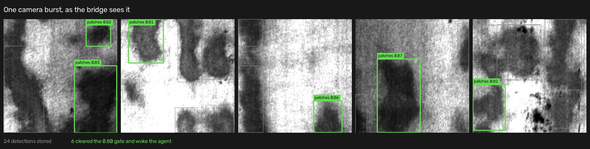

# CV → MES Agentic Defect Detection

A YOLOv8 camera watching a steel production line, wired into a synthetic
Manufacturing Execution System, where a supervisor-orchestrated team of Claude
agents investigates each defect burst and writes an evidence-backed root-cause
report.

**The camera only ever sees pixels.** Which machine, which work order, which
product, which operator, which shift — the agents find all of that for
themselves by querying the MES.



*Real output from the shipped model. Grey boxes are detections the bridge
stored; green boxes cleared the 0.80 confidence gate and are the only ones that
woke the agent. The gate is what stops a noisy camera from spending money.*

## How it fits together

```
camera image
   ↓  POST /predict            YOLOv8n, 6 NEU-DET defect classes      ~50 ms
inference API (8080)
   ↓  POST /detection          every detection stored
bridge (8081)                  confidence gate ≥ 0.80, 30-second batch window
   ↓  analyze_batch()          returns an AlertID in under a second
   ↓  POST /investigate
agent backend (8000)           Supervisor → Monitor → Analyzer, over PostgreSQL
   ↓
AgentAlerts row                pending → analyzing → done, report attached
   ↓
trace dashboard (8502)         live view of every agent, tool call and query
```

The three interesting decisions here are all about **cost and blast radius**,
because an agent run takes 40–260 seconds and costs real money:

- **A confidence gate, not every frame.** 24 detections became 1 agent run.
- **A 30-second batch window.** A burst is one investigation, not six.
- **`analyze_batch()` returns in under a second.** It hands back an `AlertID` and
  runs the agent on a background thread, so the camera is never blocked by a
  four-minute investigation.

`CONTRACTS.md` pins that seam — ports, payload shape, table schemas, and the
`analyze_batch(batch) -> int` signature — because three sub-projects with three
separate toolchains meet there.

## What the agent actually wrote

Not a mock. This is from `docs/evaluation-run1.json`:

> ### 1. DEFECT OCCURRENCE SUMMARY
> **Source: Monitor Agent, Analyzer Agent**
>
> The analysis window 2026-06-08 to 2026-07-07 contains 434 Sensor Malfunction
> defect records affecting 434 units. Motor Assembly machines dominate the
> defect distribution:
>
> | Machine | Defect Records | Units Affected | Percentage |
> |---|---|---|---|
> | Mot-51 | 114 | 129 | 26% |
> | Mot-50 | 112 | 128 | 26% |
> | Bat-40 | 71 | 74 | 16% |
>
> **HYPOTHESIS 1: Supplier Quality** — Certainty: MEDIUM. The peak defect window
> (2026-06-27 to 2026-06-28) coincides with a potential supplier batch issue, as
> no maintenance or process disruptions were detected during this period.

Every finding cites the agent and tool that produced it, and certainty is a
`HIGH`/`MEDIUM`/`LOW` label rather than a fabricated percentage — see
[reliability fixes](#reliability-fixes) for why that change was necessary.

## Measured performance

Real numbers from one machine — Claude Haiku 4.5, CPU-only inference,
PostgreSQL on localhost. Not estimates.

| Stage | Time |
|---|---|
| YOLO inference, warm | **~50 ms** per image (first request 1.3 s, model warm-up) |
| Detection → stored in PostgreSQL | under 1 s |
| `analyze_batch()` → returns AlertID | **under 1 s** (contract requires it) |
| Batch window | 30 s, fixed |
| **Burst investigation** (Monitor + Analyzer) | **37 s** |
| **Camera image → finished report** | **73 s** end to end |
| Full five-agent analysis from the dashboard | 144–260 s |

One measured burst: 5 images → 24 detections stored → 6 cleared the gate → one
batch → a 4,733-character report naming machine Fra-10, work order 4901, the
eBike T101 frame, the operator and the night shift.

Model quality is reported honestly too: across one test image per class,
**5 of 6 classes detected**. `crazing` — the subtle-texture class — detected
nothing. The demo uses `patches`, which the model handles well.

## Is the report actually right?

[`docs/evaluation.md`](docs/evaluation.md) scores the agent against faults
**deliberately injected into the data**, so there is a real answer key rather
than a judgement call. It is the most interesting document in the repository,
because it contains two failures and one of them is mine:

- **The scorer was wrong before the agent was.** The first write-up reported
  that the agent named no machine at all. It had named all three — the scorer
  matched `Machine Mot-50` (as stored in the database) against a report that
  writes `Mot-50` (as humans do). A string-matching false negative was about to
  be published as a model failure.
- **The cause metric was confounded.** `Defects.RootCause` already contains the
  literal string `Supplier Quality` in 939 rows, so an agent parroting the modal
  value scored "correct" without reasoning. Replaced with a composite that
  parroting cannot pass: name the cause **and** the affected machines **and** a
  date inside the injected window.
- **A genuine agent failure, kept.** In a camera-burst investigation the agent
  ranked "Vision System Processing Anomaly" as HIGH certainty on the strength of
  a 1,200 ms inference time against a 41–45 ms baseline. Every number it cited
  was true; the conclusion was wrong. That was model warm-up on the first
  request.

Re-scoring a report already paid for is free, so the scorer is separable from
the run:

```bash
python docs/evaluate_agent.py --rescore docs/evaluation-run1.json
```

## Running it

**You do not need an Anthropic API key to see this work.** The trained weights
and a full snapshot of the MES database are both committed, and the free mode
runs the entire pipeline — camera, confidence gate, batching, alert lifecycle —
with only the model call stubbed out. Start there.

### The short way: double-click `Start Demo.bat`

No terminal required. A small launcher (`demo.py`, tkinter, standard library
only) opens with:

- a preflight panel that checks the database, the weights, the virtualenvs and
  the `.env` **before** anything starts, and reports every problem at once
  rather than one per restart;
- **Free demo** and **Full demo** buttons, the paid one behind a confirmation;
- a **Fire a camera burst** button;
- a live table of investigations, so you watch an alert move to `done` without
  opening a database client;
- **Stop everything**, which also clears any port a crashed run left held.

Everything below still works exactly as it did — the launcher only drives it.

### Setup, once

```bash
# 1. The database. The dump is in the repo; restore it into a fresh database.
createdb -U postgres mescopy_v1
psql -U postgres -d mescopy_v1 -f sample-MES-ClosedLoop-Strands-Agent/mescopy_backup.sql

# 2. Configuration.
cp .env.example .env         # then set MES_PG_PASSWORD; chmod 600 .env on Linux/macOS

# 3. The two virtualenvs the pipeline needs.
python -m venv steel-defect-detection-mlops/.venv
steel-defect-detection-mlops/.venv/Scripts/pip install ultralytics fastapi uvicorn python-multipart prometheus-client
cd sample-MES-ClosedLoop-Strands-Agent && python startup.py    # bootstraps its own venv
```

`ANTHROPIC_API_KEY` is only needed for step 3 of the next section. The frontend
needs `npm` and its own auth values; skip it unless you want the chat UI —
nothing in the pipeline below depends on it.

### The long way: see the pipeline run from a terminal — free

Three terminals. This is what the launcher's **Free demo** button does:

```bash
# 1. the camera
cd steel-defect-detection-mlops
.venv/Scripts/python.exe -m uvicorn deployment.api:app --port 8080

# 2. the bridge, with the agent stubbed out so this costs nothing
cd industrial-data-store-simulation-chatbot
MES_ANALYZE_STUB=1 ../sample-MES-ClosedLoop-Strands-Agent/.venv/Scripts/python.exe \
    -m uvicorn bridge.bridge:app --port 8081

# 3. the burst
cd industrial-data-store-simulation-chatbot
../sample-MES-ClosedLoop-Strands-Agent/.venv/Scripts/python.exe -m bridge.simulator \
    --image-dir ../steel-defect-detection-mlops/data/demo_burst --interval 0.5
```

24 detections are stored, 6 clear the 0.80 gate, and ~30 seconds later a row in
`AgentAlerts` reaches `done` — machine Fra-10, work order 4901, defect type
`patches`. That is every seam in the system, exercised, for nothing.

### The real thing — costs money

```bash
python Launch.py     # all five services; refuses to start if a port is taken
```

Then the same simulator command. The agent actually reasons this time; the alert
appears on the dashboard at `localhost:8502` and moves `analyzing → done` with a
full report in about 73 seconds. Needs `ANTHROPIC_API_KEY` in `.env`.

`Launch.py` reads that one root `.env` and passes each service only the names it
is allowed to see. It is also the only way the Next.js app can be configured on
Windows, where its startup script refuses to read an `.env` inside `frontend/`
because it cannot verify that file's permissions there.

## What is in this repository

| Directory | What it is |
|---|---|
| `steel-defect-detection-mlops/` | YOLOv8 training and the inference API. The camera. |
| `industrial-data-store-simulation-chatbot/` | Synthetic MES data generator, plus `bridge/` — the gate, the batching, the simulator and the seam. |
| `sample-MES-ClosedLoop-Strands-Agent/` | The agent backend, the tools, and the trace dashboard. |
| `frontend/` | Next.js chat UI. |
| `CONTRACTS.md` | The binding interface: ports, payload, table shapes, and the `analyze_batch` seam. |
| `docs/evaluation.md` | Does the agent get the right answer? |

Three Python toolchains coexist deliberately (uv, plain venv, pip requirements)
because the sub-projects are separate upstreams; mixing them breaks the
inference stack. `CLAUDE.md` records the gotchas that cost time.

## Tests

```bash
cd sample-MES-ClosedLoop-Strands-Agent      && .venv/Scripts/python.exe -m pytest tests/ -q   # 133
cd industrial-data-store-simulation-chatbot && uv run pytest tests/ -q                        # 129
cd steel-defect-detection-mlops             && .venv/Scripts/python.exe -m pytest tests/ -q   #  16
cd frontend                                 && npm run test:security                          #  45
```

323 tests, **no API cost** — the model is faked at the retry boundary. They
cover the guardrails that bound spend (retry budget, hourly run budget, one
supervisor delegation per chat question, chat-history trimming that never
orphans a `toolResult`) and the security surface: internal token auth, burst
payload validation, and report paths a model cannot escape. `RUN_FULL=1`
additionally runs three real chat turns against the live API.

`tests/test_bridge_payload.py` guards the payload shape between camera and
bridge — a mismatch there once made the entire pipeline a silent no-op while
every service reported healthy.

## Design notes

### Supervisor-orchestrated, not a fixed pipeline

Hub-and-spoke: a supervisor selects, skips and reorders specialist agents
(Monitor, Analyzer, Planner, Verifier, Executor) per request. A fixed pipeline
would run unnecessary stages; peer-to-peer agent messaging would make execution
order and escalation much harder to trace.

### The agent cannot write to the MES

`run_sqlite_query` blocks `INSERT`/`UPDATE`/`DELETE`/DDL. Tools use
parameterized SQL, explicit column lists, validated date ranges, defined
ordering and result limits. The one write the system genuinely needs — the
`AgentAlerts` row — is a plain Python DB call outside the agent's tool surface,
so "the agent decided to write" is not a reachable state.

### Spend is bounded in four independent places

Confidence gate → batch window → one run at a time (`_run_guard`) → an hourly
budget on *every* paid endpoint (`/investigate`, `/analysis`, `/chat/`), which
returns HTTP 429 with `Retry-After` past `MES_MAX_RUNS_PER_HOUR` (default 10,
clamped 1–100). Failures mark the alert `failed` with a reason instead of
crashing.

### Secrets are allowlisted per service

`Launch.py` reads one root `.env` and hands each child process only the names it
needs — the inference server never sees `ANTHROPIC_API_KEY`, the frontend never
sees the database password. Secure file output has two implementations chosen by
platform: POSIX writes relative to an open directory descriptor with
`O_NOFOLLOW` and `fchmod`; Windows validates by path and inherits the NTFS ACL,
because it has none of those primitives. Both refuse symlinks, create
exclusively, and publish atomically without overwriting. A platform that is
neither fails closed.

<a id="reliability-fixes"></a>
### Reliability fixes

| Problem | Cause | Fix |
|---|---|---|
| Runs trapped in retry loops for ~3 hours | No central retry budget | Bounded retries; successful runs now complete in minutes |
| Downtime event counts inflated ~20× | Join fan-out — downtimes joined to work orders with no time condition | `dt.StartTime BETWEEN wo.ActualStartTime AND wo.ActualEndTime` |
| Reports contained invented confidence percentages | Prompt asked for numeric confidence with no method to compute it | `HIGH`/`MEDIUM`/`LOW` plus a cited source |
| Monitor agent hallucinated defect data | It had **no approved tool** to read the defects table | Added `fetch_defect_records` |
| Queries failed on `WorkOrders.ShiftID` | That column never existed; shift reaches work orders via `Employees` | Verified against the live schema and rewritten |
| Duplicate concurrent agent runs | Streamlit reruns re-entered the run path | `analysis_running` + one-shot `work_pending` flags |
| PDFs printed raw Markdown | No renderer | Markdown → ReportLab elements, content escaped |

Two of those are worth stating as lessons. **Hallucination can be a
tool-coverage problem** — an agent cannot reliably use information it has no
approved way to fetch, and no amount of prompt warning fixes that. And
**asking a model for numeric confidence instructs it to fabricate precision**;
certainty labels should match the evidence actually available.

## Limitations

- All manufacturing data is synthetic; no factory hardware is connected and
  nothing writes to a real MES. Executor actions are simulated.
- `crazing` is effectively undetected by the current weights.
- One analysis at a time; no checkpoint or resume.
- The evaluation is 1 of 3 planned runs.
- Model output can still be incomplete or wrong despite tool and prompt
  controls — see the warm-up latency failure above.

Not a production manufacturing system. It would need real authentication,
observability, deployment and human-governance controls before going near one.
