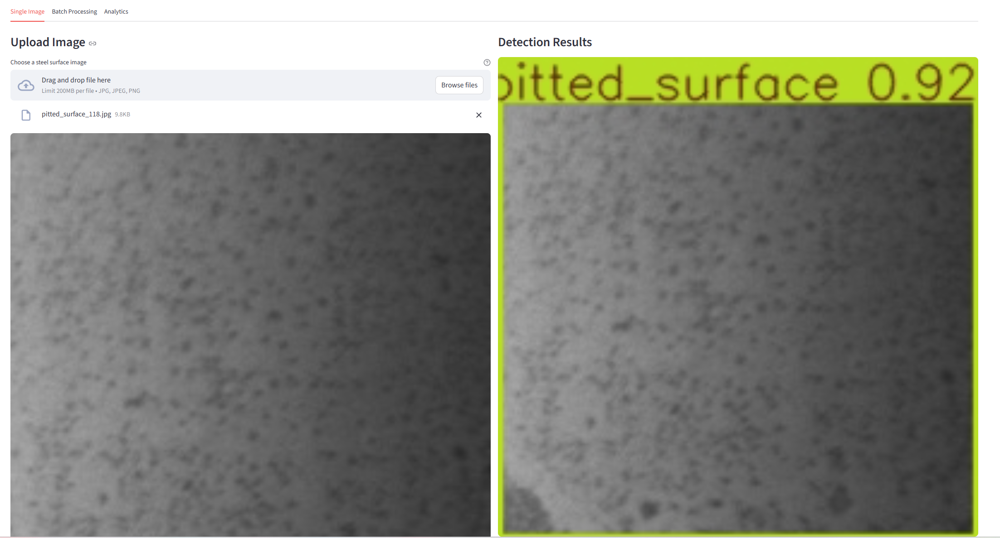
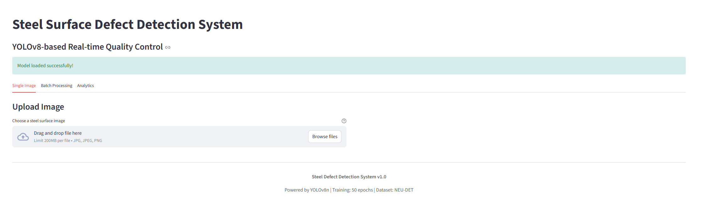
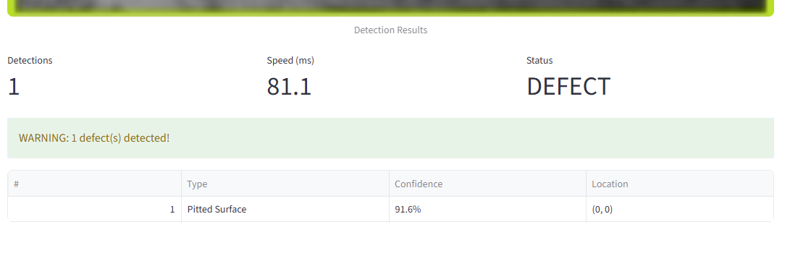

# Steel Surface Defect Detection

An end-to-end computer vision system for detecting surface defects in steel manufacturing using YOLOv8. This project started as an experiment to see if deep learning could reliably spot defects that are sometimes missed in manual quality control - turns out it works pretty well!

> **Quick Start:** Want to get running ASAP? Check out [QUICKSTART.md](QUICKSTART.md) for a 5-minute setup guide.



## Table of Contents

- [What does this do?](#what-does-this-do)
- [Getting Started](#getting-started)
  - [Prerequisites](#prerequisites)
  - [Installation](#installation)
- [Features](#features)
- [Training](#training)
- [Deployment](#deployment)
- [API Usage](#api-usage)
- [Dataset](#dataset)
- [Results](#results)
- [Troubleshooting](#troubleshooting)
- [Contributing](#contributing)
- [License](#license)

---

## What does this do?

The system looks at images of steel surfaces and identifies six types of common defects:

- **Crazing** - fine cracks in the surface
- **Inclusions** - foreign materials embedded in steel
- **Patches** - irregular surface areas
- **Pitted surfaces** - small holes and pits
- **Rolled-in scale** - defects from the rolling process
- **Scratches** - linear surface scratches

I trained a YOLOv8 model on the NEU Steel Surface Defect Database and got it working at **76.47% mAP50** with inference speeds around **81ms** on CPU. The model is small (6.2MB) which makes it practical for deployment.

## Getting Started

### Prerequisites

- Python 3.10 or higher
- Git
- 2GB free disk space (for dependencies and model)

### Installation

1. **Clone the repository**

```bash
git clone https://github.com/yourusername/steel-defect-detection-mlops.git
cd steel-defect-detection-mlops
```

2. **Create a virtual environment** (recommended)

```bash
# Windows
python -m venv venv
venv\Scripts\activate

# Linux/Mac
python3 -m venv venv
source venv/bin/activate
```

3. **Install dependencies**

```bash
pip install -r requirements.txt
```

4. **Download the trained model**

You have three options:

**Option A: Use pre-trained model** (recommended for quick start)

Download the model weights automatically:

```bash
python scripts/download_model.py
```

Or manually download from [GitHub Releases](https://github.com/yourusername/steel-defect-detection-mlops/releases) and place at:

```
runs/detect/steel_defect_colab_50_epochs/weights/best.pt
```

See [MODEL_WEIGHTS.md](MODEL_WEIGHTS.md) for detailed instructions.

**Option B: Use included weights** (if available)

If you cloned from a release that includes weights, the model should already be at:

```
runs/detect/steel_defect_colab_50_epochs/weights/best.pt
```

**Option C: Train your own model**

See the [Training](#training) section below for instructions.

5. **Run the application**

```bash
# Start the web interface
streamlit run streamlit_app.py
```

Open http://localhost:8501 in your browser and drag-drop a steel surface image to test it out!

**Test Images:** If you have the NEU dataset downloaded (`data/dataset/images/test/`), you can use those. Otherwise, upload any steel surface image to try it out.



## Features

### Web Interface

Built with Streamlit for easy testing:

- Drag-and-drop image upload
- Real-time defect detection with visual bounding boxes
- Adjustable confidence threshold
- Batch processing for multiple images
- Training metrics visualization with interactive charts



### REST API

FastAPI backend for production use:

- `/predict` - Single image inference
- `/batch-predict` - Process multiple images at once
- `/metrics` - Prometheus metrics endpoint
- `/health` - Service health check
- Interactive Swagger UI documentation at `/docs`

### MLOps Pipeline

- **MLflow** for experiment tracking and model versioning
- **DVC** for data versioning
- **Docker** containerization for deployment
- **Prometheus/Grafana** monitoring (optional)

## Project Structure

```
├── src/
│   ├── data_preprocessing/    # Convert annotations, split datasets
│   ├── training/              # Training pipeline with YOLOv8
│   └── utils/                 # Helper functions
├── deployment/                # Docker, API, compose files
├── configs/                   # Dataset and training configs
├── runs/                      # Training results
├── streamlit_app.py          # Web UI
└── requirements.txt
```

## Training

**Note:** You only need to follow these steps if you want to train the model from scratch. The pre-trained model is already included for inference.

### 1. Download the NEU Dataset

Download the **NEU Steel Surface Defect Database**:

- Source: [Kaggle - NEU Surface Defect Database](https://www.kaggle.com/datasets/kaustubhdikshit/neu-surface-defect-database)
- Or: [Original source](http://faculty.neu.edu.cn/yunhyan/NEU_surface_defect_database.html)

Extract to `data/NEU-DET/` directory.

### 2. Preprocess the data

```bash
# Convert XML annotations to YOLO format
python src/data_preprocessing/xml_to_yolo.py \
    --root data/NEU-DET \
    --out data/labels

# Split into train/val/test
python src/data_preprocessing/split_data.py \
    --source data/NEU-DET \
    --output data/dataset
```

### 3. Train the model

Local training (if you have GPU):

```bash
python src/training/train.py \
    --data configs/neu_defect.yaml \
    --epochs 50 \
    --batch 16
```

Google Colab training (recommended):

I used Google Colab with a T4 GPU. The whole process took about 19 minutes for 50 epochs:

1. Upload `notebooks/steel_defect_colab.ipynb` to Google Colab
2. Connect to a GPU runtime (Runtime → Change runtime type → GPU)
3. Run all cells
4. Download the trained model from Colab to `runs/detect/steel_defect_colab_50_epochs/weights/best.pt`

### 4. Track experiments with MLflow

```bash
mlflow ui --port 5000
```

Then check http://localhost:5000 to see all your runs with metrics, parameters, and comparisons.

## Results

After 50 epochs of training:

- **Precision**: 74.79%
- **Recall**: 69.39%
- **mAP50**: 76.47%
- **mAP50-95**: 43.28%
- **Inference Speed**: ~81ms per image (CPU)

The model performs best on scratches and patches, but struggles a bit with subtle crazing patterns. There's definitely room for improvement - maybe trying YOLOv8m or adding more augmentation could help.

## Deployment

### Option 1: Local Testing (easiest)

```bash
streamlit run streamlit_app.py
```

Opens at http://localhost:8501

### Option 2: API Server

```bash
uvicorn deployment.api:app --port 8080
```

API documentation available at http://localhost:8080/docs

### Option 3: Full Stack with Docker

```bash
docker-compose -f deployment/docker-compose.full.yml up
```

This spins up:

- **FastAPI** (port 8080) - REST API
- **Streamlit UI** (port 8501) - Web interface
- **MLflow** (port 5000) - Experiment tracking
- **Prometheus** (port 9090) - Metrics collection
- **Grafana** (port 3000) - Dashboards and visualization

## API Usage

Simple Python example:

```python
import requests

with open("steel_image.jpg", "rb") as f:
    response = requests.post(
        "http://localhost:8080/predict",
        files={"file": f},
        params={"confidence": 0.25}
    )

result = response.json()
print(f"Found {result['num_detections']} defects")
for detection in result['detections']:
    print(f"  - {detection['class']}: {detection['confidence']:.1%}")
```

Or using curl:

```bash
curl -X POST "http://localhost:8080/predict" \
  -F "file=@steel_image.jpg" \
  -F "confidence=0.25"
```

## Dataset

Using the **NEU Steel Surface Defect Database**:

- 1,800 grayscale images (200x200px)
- 6 defect classes with balanced distribution
- Annotations in both XML (PASCAL VOC) and TXT (YOLO) format

I split it 70/20/10 for train/val/test. The preprocessing scripts handle converting from XML to YOLO format if needed.

Data preprocessing:

```bash
# Convert XML annotations to YOLO format
python src/data_preprocessing/xml_to_yolo.py \
    --root data/NEU-DET \
    --out data/labels

# Split into train/val/test
python src/data_preprocessing/split_data.py \
    --source data/NEU-DET \
    --output data/dataset
```

## Requirements

Main dependencies:

- Python 3.10+
- PyTorch >= 1.12.0
- Ultralytics (YOLOv8)
- Streamlit >= 1.28.0
- FastAPI >= 0.95.0
- MLflow >= 2.8.0

Full list in `requirements.txt`

Installation:

```bash
pip install -r requirements.txt
```

## Things I learned

1. **Data quality matters more than model size** - Spent more time cleaning annotations than tuning hyperparameters
2. **YOLOv8n is surprisingly good** - Initially tried YOLOv8s but the nano version was fast enough and way smaller
3. **Transfer learning works** - Starting from COCO pretrained weights saved a lot of training time
4. **Don't skip validation** - Caught several issues by actually looking at predictions on the validation set
5. **Real-time inference is possible** - With optimization, can run at ~12 FPS on CPU which is good enough for many use cases

## Future Improvements

Some ideas I want to try:

- [ ] Test YOLOv8m for better accuracy (trading off model size)
- [ ] Add more data augmentation (rotation, brightness, contrast)
- [ ] Try ensemble of multiple models
- [ ] Deploy on edge device (Jetson Nano or similar)
- [ ] Add active learning pipeline for continuous improvement
- [ ] Better handling of class imbalance
- [ ] Export to ONNX/TensorRT for faster inference

## Known Issues

- Model sometimes confuses patches with pitted surfaces (similar texture)
- Very small defects (<10px) are often missed
- Doesn't handle non-square input images well (resizes/crops)
- Batch processing could be parallelized better

## Running on Google Colab

I've included a notebook (`notebooks/steel_defect_colab.ipynb`) that has the full training pipeline. Just upload it to Colab, connect to a GPU runtime, and run all cells. It'll automatically:

1. Download the NEU dataset
2. Preprocess the data
3. Train YOLOv8
4. Save results to Google Drive
5. Export the trained model

No local GPU needed!

## Monitoring

The system includes Prometheus metrics for production monitoring:

- `api_requests_total` - Total number of API requests
- `inference_duration_seconds` - Inference time distribution
- `detections_total` - Number of detections by class

Access metrics at http://localhost:8080/metrics

For visualization, Grafana dashboards are included in `monitoring/` directory.

## Contributing

If you find issues or have ideas for improvements, feel free to open an issue or PR. Some areas where help would be appreciated:

- Better data augmentation strategies
- Optimizing inference speed
- Testing on different steel types
- Documentation improvements
- Adding more defect classes

## Troubleshooting

**"Model not found" error:**

The model weights file is missing. You need to either:

1. Download pre-trained model from [Google Drive link] and place at `runs/detect/steel_defect_colab_50_epochs/weights/best.pt`
2. Train the model yourself following the [Training](#training) section
3. Create the directory structure if it doesn't exist:
   ```bash
   mkdir -p "runs/detect/steel_defect_colab_50_epochs/weights"
   ```

**"ModuleNotFoundError" when running:**

Make sure you've installed all dependencies and activated your virtual environment:

```bash
# Activate venv first
source venv/bin/activate  # Mac/Linux
venv\Scripts\activate     # Windows

# Then install
pip install -r requirements.txt
```

**Streamlit shows "Model loading failed":**

- Verify the model file exists at the expected path
- Check file size (should be around 6.2MB for best.pt)
- Try running with verbose mode to see detailed error

**Slow inference:**

- First run is always slower (model initialization)
- Try reducing image size in config
- Use GPU if available (modify code to set `device='cuda'`)
- Consider using YOLOv8n-int8 quantized model

**Docker build fails:**

- Update package names if using newer Debian/Ubuntu (e.g., `libgl1` instead of `libgl1-mesa-glx`)
- Check that model weights are in correct location before building
- Ensure Docker has enough memory allocated (at least 4GB recommended)

## License

MIT License - feel free to use this for your own projects

## Acknowledgments

- NEU Database team for providing the steel defect dataset
- Ultralytics for the excellent YOLOv8 implementation
- The open source community for tools like FastAPI, Streamlit, and MLflow

## Contact

Questions? Found a bug? Open an issue on GitHub and I'll try to help.

---

Built this as a learning project to understand end-to-end MLOps workflows. Learned a ton about computer vision, deployment, and what it takes to go from notebook to production. Hope it's useful!

# Steel Defect Detection MLOps Pipeline

A complete MLOps pipeline for steel surface defect detection using YOLOv8 and the NEU Steel Surface Defect Database. This project demonstrates end-to-end machine learning operations from data preprocessing to model deployment.

# Steel Defect Detection MLOps Pipeline

A complete MLOps pipeline for steel surface defect detection using YOLOv8 and the NEU Steel Surface Defect Database. This project demonstrates end-to-end machine learning operations from data preprocessing to model deployment.

## 🎯 Project Overview

This project implements a comprehensive computer vision solution for detecting surface defects in steel materials. Using the NEU Steel Surface Defect Database, we train YOLOv8 models to identify 6 types of common steel defects with high accuracy.

### Defect Classes

- **Crazing**: Surface cracking patterns
- **Inclusion**: Foreign material inclusions
- **Patches**: Irregular surface patches
- **Pitted Surface**: Small surface pits and holes
- **Rolled-in Scale**: Scale defects from rolling process
- **Scratches**: Linear surface scratches

## 🏆 Performance Results

Our YOLOv8n model achieved excellent performance on the NEU dataset:

- **mAP50**: 76.47% - Mean Average Precision at IoU threshold 0.5
- **mAP50-95**: 43.28% - Mean Average Precision averaged across IoU thresholds 0.5-0.95
- **Training Time**: ~19 minutes on Tesla T4 GPU (50 epochs)
- **Model Size**: 6.2MB (YOLOv8n optimized for speed)

## 📁 Project Structure

```
steel-defect-detection-mlops/
│
├── src/                          # Source code modules
│   ├── data_preprocessing/       # Data preprocessing scripts
│   │   ├── xml_to_yolo.py       # XML to YOLO format converter
│   │   └── split_data.py        # Dataset splitting utility
│   ├── training/                 # Training modules
│   │   └── train.py             # YOLOv8 training pipeline
│   └── utils/                    # Utility functions
│
├── data/                         # Dataset and processed data
│   ├── NEU-DET/                 # Original NEU dataset
│   │   ├── train/
│   │   └── validation/
│   ├── labels/                   # YOLO format labels
│   │   ├── train/
│   │   └── validation/
│   └── dataset/                  # Train/val/test splits
│       ├── images/
│       └── labels/
│
├── configs/                      # Configuration files
│   ├── neu_defect.yaml          # Dataset configuration
│   └── train_config.yaml       # Training configuration
│
├── notebooks/                    # Jupyter notebooks
│   └── steel_defect_colab.ipynb # Google Colab training notebook
│
├── models/                       # Trained models
│   └── (best.pt, last.pt)      # Model weights
│
├── runs/                         # Training results and experiments
│   └── detect/                  # YOLOv8 training outputs
│
├── deployment/                   # Deployment configurations
│   ├── Dockerfile              # Docker container
│   └── docker-compose.yml      # Docker Compose setup
│
├── scripts/                      # Utility scripts
│   └── (deployment scripts)
│
├── docs/                         # Documentation
│
├── requirements.txt              # Python dependencies
├── setup.py                     # Package setup
├── .gitignore                   # Git ignore rules
└── README.md                    # This file
```

## 🚀 Quick Start

### 1. Environment Setup

```bash
# Clone the repository
git clone https://github.com/ylmzelff/steel-defect-detection-mlops.git
cd steel-defect-detection-mlops

# Create virtual environment
python -m venv venv
source venv/bin/activate  # On Windows: venv\Scripts\activate

# Install dependencies
pip install -r requirements.txt
```

# Convert XML annotations to YOLO format

python src/data_preprocessing/xml_to_yolo.py --root data/NEU-DET --out data/labels

### 3. Model Training

```bash
# Train YOLOv8 model locally
python src/training/train.py --data configs/neu_defect.yaml --epochs 50 --batch 16

# Or use Google Colab notebook
# Open notebooks/steel_defect_colab.ipynb in Google Colab
```

### 4. Model Evaluation

```bash
# Evaluate trained model
python src/training/train.py --evaluate runs/detect/steel_defect_experiment/weights/best.pt
```

## 📊 Dataset Information

## 🛠️ Technology Stack

- **Deep Learning**: YOLOv8 (Ultralytics)
- **Deployment**: Docker, FastAPI
- **Cloud**: Google Colab, AWS/Azure (configurable)

## 📈 Training Pipeline

1. **Data Preprocessing**: Convert XML annotations to YOLO format
2. **Data Splitting**: Create reproducible train/validation/test splits
3. **Model Training**: Train YOLOv8 with optimized hyperparameters
4. **Validation**: Real-time validation during training
5. **Model Export**: Export to multiple formats (PyTorch, ONNX, TensorRT)
6. **Deployment**: Containerized deployment with API endpoints

## 🔧 Configuration

### Training Configuration (`configs/train_config.yaml`)

- Early stopping and model checkpointing

### Dataset Configuration (`configs/neu_defect.yaml`)

- Dataset paths and class definitions

## 📋 Requirements

torchvision>=0.13.0
Pillow>=9.0.0
PyYAML>=6.0
numpy>=1.21.0
matplotlib>=3.5.0
seaborn>=0.11.0
tqdm>=4.64.0

````

## 🐳 Docker Deployment

```bash
# Build Docker image
docker build -t steel-defect-detector .

# Run container
docker run -p 8080:8080 steel-defect-detector

# Or use Docker Compose
docker-compose up -d
````

## 📊 Model Performance

### Training Metrics (50 epochs)

- **Final Training Loss**: 1.165 (box) + 1.068 (cls) + 1.423 (dfl)
- **Final Validation Loss**: 1.496 (box) + 1.180 (cls) + 1.651 (dfl)
- **Precision**: 74.79%
- **Recall**: 69.39%
- **mAP50**: 76.47%
- **mAP50-95**: 43.28%

### Inference Performance

- **Speed**: ~10ms per image (Tesla T4)
- **Model Size**: 6.2MB (YOLOv8n)
- **FPS**: ~100 FPS on GPU

## 🤝 Contributing

1. Fork the repository
2. Create a feature branch (`git checkout -b feature/AmazingFeature`)
3. Commit your changes (`git commit -m 'Add some AmazingFeature'`)
4. Push to the branch (`git push origin feature/AmazingFeature`)
5. Open a Pull Request

## 📄 License

This project is licensed under the MIT License - see the [LICENSE](LICENSE) file for details.

## 🙏 Acknowledgments

- **NEU Steel Surface Defect Database**: Dataset providers
- **Ultralytics**: YOLOv8 implementation
- **PyTorch Team**: Deep learning framework
- **Google Colab**: Cloud training environment

## 📧 Contact

**Steel Defect Detection Team**

- GitHub: [@ylmzelff](https://github.com/ylmzelff)
- Project: [steel-defect-detection-mlops](https://github.com/ylmzelff/steel-defect-detection-mlops)

## 🔗 Useful Links

- [YOLOv8 Documentation](https://docs.ultralytics.com/)
- [NEU Dataset Paper](https://scholar.google.com/scholar?q=NEU+steel+surface+defect+database)
- [Steel Defect Detection Survey](https://scholar.google.com/scholar?q=steel+surface+defect+detection+computer+vision)

---

⭐ If this project helped you, please give it a star! ⭐
